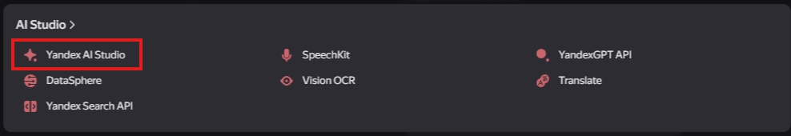
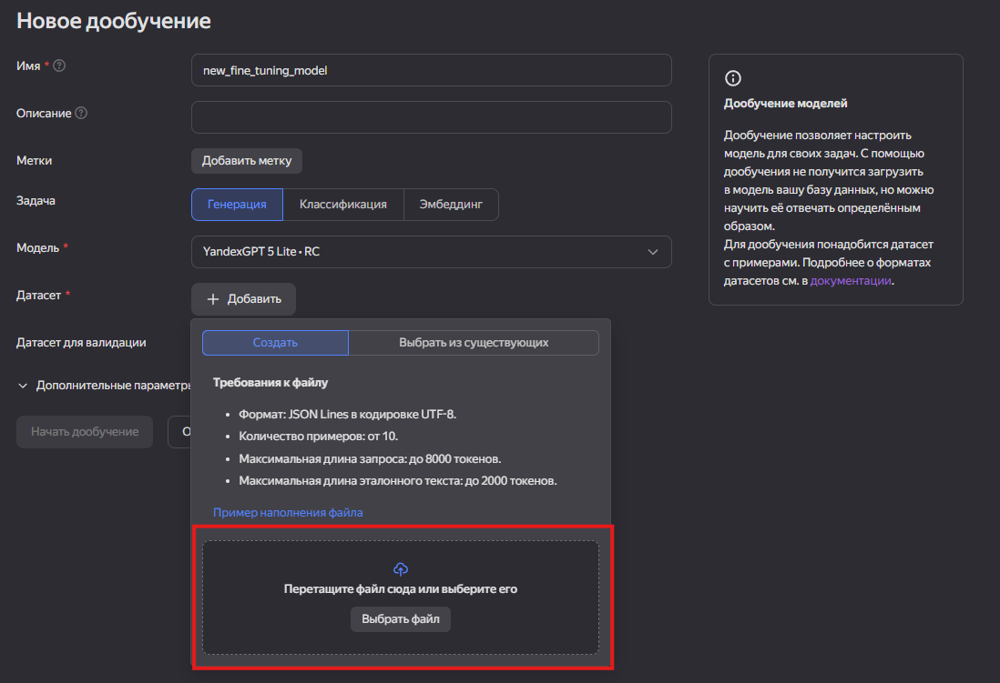
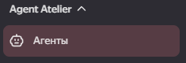
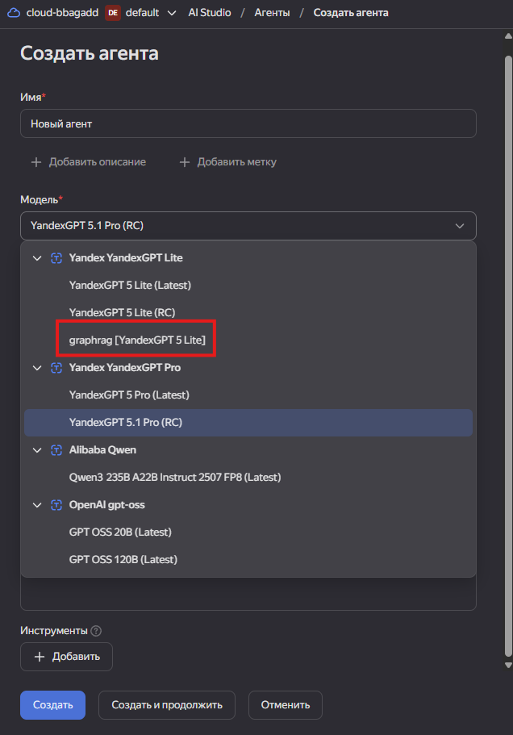
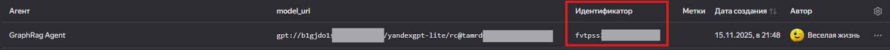

# GraphRAG Telegram Bot

Проект разворачивает Telegram-бота поверх Retrieval-Augmented Generation (RAG) с графовой Neo4j и локальной LLM (через Ollama). Бот умеет загружать PDF, извлекать факты, отвечать на вопросы и сравнивать ответы с Yandex GPT.

## Быстрый старт

1. Установите Docker / Docker Compose и заполните `.env` файлы в `app/src/server` и `app/src/bot` (см. `.env.example`).
2. Запустите окружение:
   ```bash
   docker-compose up --build -d
   ```
   Контейнеры `neo4j_container`, `ollama_container`, `fastapi_container`, `bot_container` должны стать `healthy`.
3. Загрузите документы в Neo4j через API:
   ```bash
   curl -X POST "http://localhost:8000/process_pdf/"         -H "accept: application/json"         -H "Content-Type: multipart/form-data"         -F "pdf_file=@/path/to/your/document.pdf;type=application/pdf"
   ```
4. Документация FastAPI доступна на `http://localhost:8000/docs`.
5. Создайте бота у @BotFather, пропишите токен в `.env` и отправьте `/start`.

## Основные эндпоинты

* `POST /process_pdf/` – загрузить PDF и записать факты в Neo4j.
* `POST /answer_question/` – ответить на вопрос, используя RAG.
* `POST /compare_answers/` – сравнить локальную LLM и Yandex GPT.
* `GET /get_topics/`, `GET /get_topic/{name}` – справочник тем.

## Команды Telegram-бота

* `/start` – показать главное меню.
* `/menu` – вернуться в меню.
* `1` – задать вопрос LLM.
* `2` – открыть справочник.
* `3` – сравнить ответы (локальная ↔ Yandex GPT).

## Ресурсы и GPU

* Ollama и Neo4j потребляют CPU/RAM – следите за лимитами Docker.
* Для GPU установите `nvidia-container-toolkit` и пропишите `deploy.resources.reservations.devices` в `docker-compose.yml`, чтобы Ollama видела видеокарту.

## Дообучение и подключение собственной модели

### 1. Запустить обучение
```bash
python scripts/submit_fine_tune.py app/data_for_train/lat_marketing_dataset.jsonl   --user-id 1001 --split train --limit 200   --mode async --poll --base-url http://localhost:8000   --run-name marketing-train-v1 --learning-rate 5e-5 --num-epochs 1 --max-seq-length 768
```
После завершения в ответе появится `model_path`, например `/app/models/fine_tuned/marketing-train-v1`.

### 2. Проверить качество
```bash
python scripts/test_dataset.py app/data_for_train/lat_marketing_dataset.jsonl   --split test --limit 100 --base-url http://localhost:8000 --verbose
```
Скрипт дергает `/compare_answers/`, поэтому сравнивает локальную модель и новую модель Яндекса (через сервер).

### Формат JSONL для обучения
Каждая строка датасета представляет собой самостоятельный пример:
```json
{
  "task": "classification",
  "prompt": "Это вертикальный или латеральный маркетинг: Кофе: нацелить на владельцев длинношёрстных пород с отдельной программой.",
  "response": "латеральный",
  "evidence": ["Смена аудитории/потребности/ситуации использования."],
  "meta": {
    "source": "Котлер_Латеральный_маркетинг.pdf",
    "created_at": "2025-11-12T20:44:34.168470Z",
    "chapter": "Примеры",
    "page": null
  },
  "labels": ["латеральный"],
  "split": "train"
}
```
- `task` — тип задания (classification, abstractive_qa и т. д.).
- `prompt`/`response` — инструкция и ожидаемый ответ.
- `evidence` — контекст/обоснование, попадает в `context`.
- `meta` — дополнительные атрибуты; передаются в `metadata` и могут попадать в prompt.
- `labels` — вспомогательные метки (например, истинный класс).
- `split` — разметка train/test/all, чтобы скрипты можно было запускать с `--split`.

Файл храним в UTF-8, одна строка = один JSON-объект.

Конвертируем формат JSONL в формат Яндекса:
```bash
python scripts/jsonl_dataset.py app/data_for_train/lat_marketing_dataset.jsonl   --split train --prompt-key prompt --response-key response   --evidence-key evidence --meta-key meta --split-key split --include-meta --limit 200

python scripts/jsonl_dataset.py app/data_for_train/lat_marketing_dataset.jsonl app/data_for_train/lat_marketing_dataset_yandex.jsonl --split train --system-prompt "…" --include-labels
```






Загружаем созданный файл для яндекса, название и описание произвольным. Параметры обучения не менять.

Далее открываем "Агенты" -> "Создать агента". Выбираем дообученную модель:





После этого агент отобразится в списке агентов. Необходимо скопировать ID агента, заменить в .env файле YANDEX_AGENT_ID




### 3. Зарегистрировать модель в Ollama
```bash
cat <<'EOF' > Modelfile
FROM qwen:0.5b
ADAPTER /app/models/fine_tuned/marketing-train-v1
EOF
ollama create marketing-train-v1 -f Modelfile
```
Важно: каталог `models/fine_tuned` должен быть примонтирован в контейнер Ollama.

### 4. Подключить FastAPI
В `app/src/server/.env` установите `OLLAMA_MODEL_NAME=marketing-train-v1` и перезапустите сервис:
```bash
docker compose restart fastapi
```
Теперь все эндпоинты используют дообученную модель.

### 5. Проверочные скрипты
* `scripts/simple_test.py` – прогон нескольких вопросов, вывод ожидаемого/локального/яндексового ответа

### 6. Версионирование
Храните каталоги `model_path`. Чтобы откатиться, выполните `ollama create <старое-имя>` с прежним адаптером и верните `OLLAMA_MODEL_NAME`.

## Полезные команды

* Остановить сервисы:
  ```bash
  docker-compose down
  ```
* Полностью пересоздать окружение (с volume-ами):
  ```bash
  docker-compose down -v
  ```
* Логи:
  ```bash
  docker-compose logs -f fastapi
  docker-compose logs -f bot
  docker-compose logs -f ollama
  ```

Если Ollама пишет `libnvidia-ml.so.1 not found`, переустановите Docker с поддержкой NVIDIA и убедитесь, что toolkit настроен корректно.
